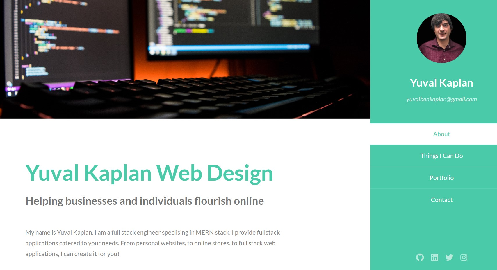

# My Portfolio
Public portfolio for Yuval Kaplan. Contains my contact information, examples of my work, and a form to send me emails.

**Link to project:** https://yuvalkaplanwebdesign.netlify.app/

## How It's Made:

**Tech used:** HTML, CSS, JavaScript, Node / Express, MongoDB, Heroku

I used a template from html5up.com for the layout. Added my picture, about me section, contact info and professional links.
Deployed on Netlify. Used Netlify's email client to connect the form to my personal email account.
Added personal projects with links and thumbnail pictures. Added links to Github repos.

## Optimizations

First used FormSubmit to connect the form to my personal email account, found response time to be quite slow. Switched to Netlify's built in email client, found it to be much faster

## Lessons Learned:

Lesson 1: keep things in-house. Since app is deployed on Netlify, using Netlify's built in email client works much faster and with less hassle then plugging in an external client like FormSubmit

